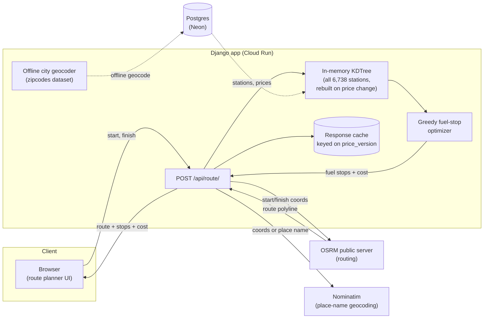
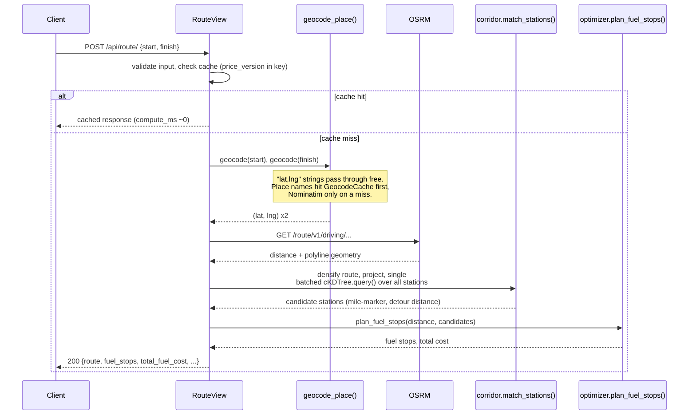
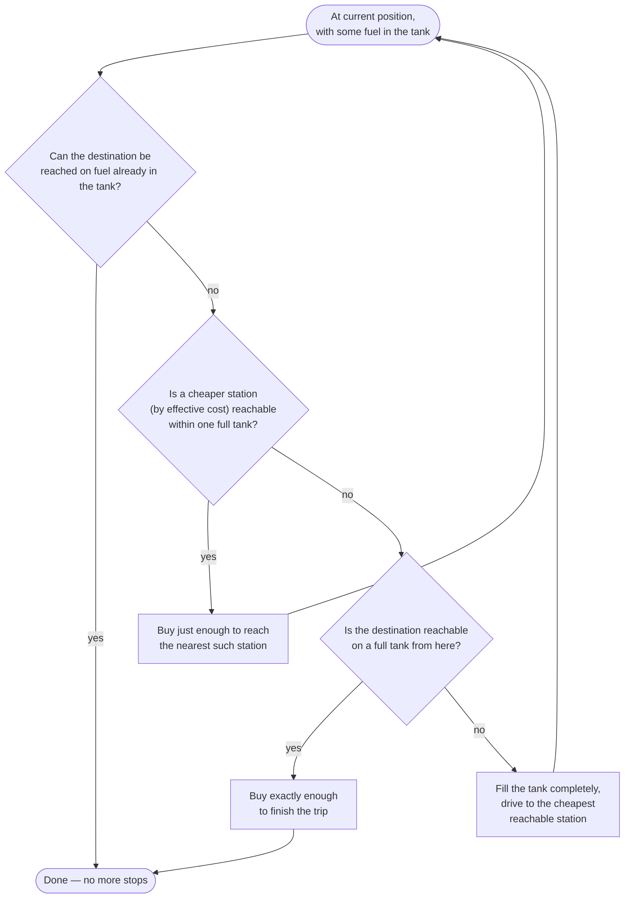
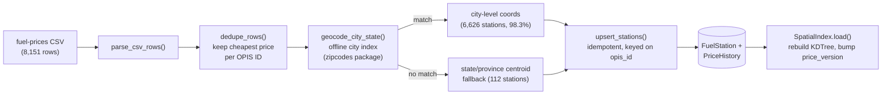

# Trucker — Fuel Route Optimizer

Given a start and finish location in the US, this returns the driving route, the cost-optimal
set of fuel stops for a 500-mile tank range at 10 mpg, and the total fuel cost — computed from a
real dataset of 6,738 truck stops.

**Live demo: https://trucker-319172055462.us-east4.run.app**

| Page | What it shows |
|---|---|
| [`/`](https://trucker-319172055462.us-east4.run.app/) | Route planner — enter a start/finish, get the route + fuel stops on a map |
| [`/dashboard/`](https://trucker-319172055462.us-east4.run.app/dashboard/) | Fleet-wide price aggregates (avg/min/max, geocode precision, top networks) |
| [`/fuel/`](https://trucker-319172055462.us-east4.run.app/fuel/) | Searchable/filterable directory over all 6,738 stations |
| [`/analytics/`](https://trucker-319172055462.us-east4.run.app/analytics/) | Full state-by-state and brand-by-brand price breakdown |

---

## Contents

- [How it works](#how-it-works)
- [The optimizer, and why it's optimal](#the-optimizer-and-why-its-optimal)
- [Data pipeline](#data-pipeline)
- [Running it yourself](#running-it-yourself)
- [API](#api)
- [Price-update design](#price-update-design)
- [Assumptions](#assumptions)
- [Tech stack](#tech-stack)
- [Tests](#tests)

---

## How it works



A request only ever makes **one external HTTP call for coordinate input**, or **up to three**
for place names (two Nominatim lookups + one OSRM call) — everything else (station lookup,
corridor matching, the optimizer) runs against data already in memory or the database.

### Request sequence



### Corridor matching

Rather than build a tree over ~6,700 stations and probe it once per route point, the route
geometry (densified so no gap exceeds 2 miles, then downsampled to roughly one point per 2 miles)
becomes a small KDTree, and **every station is queried against it in one batched call**
(`scipy.spatial.cKDTree.query(..., workers=-1)`). That single call returns, for every station,
its nearest point on the route (→ mile-marker) and the distance to it (→ detour miles) — stations
farther than the configurable detour radius (default 10 mi) are dropped.

---

## The optimizer, and why it's optimal

At each stop, the rule is simple: **if a cheaper station is reachable within one full tank, buy
only enough fuel to reach it; otherwise fill up completely and drive to the cheapest station in
range.**



**Why this is optimal:** with a fixed tank range, the cheapest way to fuel a trip is to always
delay buying gas for as long as possible, buying only enough to reach the next opportunity that's
*at least as good*. At any station, if a reachable station ahead is cheaper, buying more than the
minimum needed to reach it is strictly wasteful — those extra gallons could be bought cheaper very
soon. Conversely, if nothing ahead is cheaper, every gallon needed for the next full tank's worth
of driving is best bought right now, at the best price available for a while — so fill up
completely. This is a textbook greedy-exchange argument: any schedule that deviates from these two
rules can be transformed into one that follows them without increasing cost.

Three refinements on top of the textbook version:

1. **Stations are ranked by *effective* cost**, not sticker price: `price + (2 × detour_miles /
   mpg) × price` — the cost of the fuel burned making the round trip off the highway and back. A
   cheap-but-far station can correctly lose to a pricier-but-closer one.
2. **The destination is a free, always-available target.** Once it's reachable on the current
   tank, the optimizer buys only the exact remainder needed and stops — it never tops off fuel
   that will never be used.
3. **The tank starts empty, not full.** There's no fuel price defined at the origin itself, so
   the truck can't price-shop before its first fill — it fuels up at the station nearest the
   origin (whatever that costs), a real, charged stop, and applies the same cheaper-ahead-or-
   fill-full rule from there on. Every trip with positive distance buys real fuel and gets at
   least one stop; only a zero-distance trip (start == finish) needs none.

If the nearest station to the origin is itself beyond one tank's reach, or if any stretch of the
route exceeds the tank range with no station in reach on either side, the API returns `422` with
the exact position and shortfall, rather than silently failing.

---

## Data pipeline



`python manage.py load_fuel_data` is the entry point — it's a full offline pipeline with **zero
external network calls** (geocoding uses the `zipcodes` package's bundled US city/ZIP dataset, not
a live geocoding API) and is safe to re-run: unchanged rows are no-ops, changed prices append to
`PriceHistory`, and running it twice in a row produces `0` new stations and `0` price updates.

---

## Running it yourself

### Docker Compose (recommended)

```bash
docker compose up -d          # Postgres + Django, migrates on boot
docker compose exec web python manage.py load_fuel_data
```

Then open http://localhost:8000/.

### Local virtualenv

```bash
python -m venv .venv && source .venv/bin/activate   # or .venv\Scripts\activate on Windows
pip install -r requirements-dev.txt

cp .env.example .env    # edit DATABASE_URL to point at your Postgres

docker compose up -d db          # or run your own local Postgres
python manage.py migrate
python manage.py load_fuel_data
python manage.py runserver
```

### Tests (no Docker needed)

```bash
pytest
```

Uses an in-memory SQLite database (`config.settings.test`) — nothing under test relies on
Postgres-specific behavior, so this runs the full suite in about a second.

---

## API

### `POST /api/route/`

```bash
curl -X POST https://trucker-319172055462.us-east4.run.app/api/route/ \
  -H "Content-Type: application/json" \
  -d '{"start": "Milwaukee, WI", "finish": "Madison, WI"}'
```

`start` / `finish` each accept either `"City, ST"` or a raw `"lat,lng"` coordinate pair (the
latter skips geocoding entirely). The tank starts empty, so even a trip that fits under the tank
range buys real fuel at the nearest station and returns a real stop:

```json
{
  "total_distance_miles": 78.1,
  "total_fuel_cost": 24.09,
  "fuel_stops": [
    {
      "name": "PILOT #212",
      "address": "I-94 Exit 306",
      "city": "Milwaukee",
      "state": "WI",
      "price_per_gallon": 3.085,
      "gallons": 7.81,
      "cost": 24.09,
      "miles_from_start": 3.4,
      "detour_miles": 0.3,
      "latitude": 43.061,
      "longitude": -87.921
    }
  ],
  "route": { "type": "LineString", "coordinates": [[-87.909, 43.039], ...] },
  "price_version": 1,
  "cached": false,
  "compute_ms": 2079.23
}
```

A longer trip returns multiple stops:

```json
{
  "total_distance_miles": 2798.2,
  "total_fuel_cost": 755.30,
  "fuel_stops": [
    {
      "name": "ACI TRUCK STOP",
      "address": "US-46",
      "city": "Columbia",
      "state": "NJ",
      "price_per_gallon": 3.079,
      "gallons": 6.31,
      "cost": 19.43,
      "miles_from_start": 60.8,
      "detour_miles": 1.2,
      "latitude": 40.9388,
      "longitude": -75.055
    }
  ],
  "route": { "type": "LineString", "coordinates": [ /* ... */ ] },
  "price_version": 1,
  "cached": false,
  "compute_ms": 1485.0
}
```

Repeating the exact same request returns `"cached": true` with `compute_ms` near zero — responses
are cached with the current `price_version` baked into the cache key, so a price reload
invalidates every cached route automatically without an explicit purge.

### `GET /api/places/?q=...`

Offline autocomplete for the Start/Finish inputs — zero network calls, backed by the same
`zipcodes` dataset used for station geocoding.

```bash
curl "https://trucker-319172055462.us-east4.run.app/api/places/?q=ne"
```

```json
{"results": [
  {"label": "Newark, NJ", "lat": 40.7361, "lng": -74.2251},
  {"label": "New York, NY", "lat": 40.7484, "lng": -73.9967}
]}
```

### Errors

| Status | When | Example |
|---|---|---|
| `400` | Missing/blank `start` or `finish` | `{"error": {"finish": ["This field is required."]}}` |
| `404` | A location couldn't be geocoded | `{"error": "Location not found: 'Zzzqqxnowhere'"}` |
| `422` | A stretch of the route exceeds the tank range with no reachable station | `{"error": "No fuel station reachable within 500 miles of mile 36.2 (532.9 miles remain to the destination) — route has an unreachable fuel gap."}` |
| `502` | OSRM or Nominatim didn't respond | `{"error": "OSRM request timed out."}` |

---

## Price-update design

- **`FuelStation`** holds current identity + price only; **`PriceHistory`** is an append-only log,
  one row per actual price change (not one row per load run — re-running the loader against
  unchanged prices produces zero new history rows).
- The loader (`load_fuel_data`) is an **idempotent upsert keyed on OPIS Truckstop ID**: new IDs
  insert, existing IDs update in place. Duplicate OPIS IDs within one CSV (a handful of stations
  are listed under two names) are deduped to the cheapest price before the upsert runs.
- A module-level `SpatialIndex` holds the KDTree, coordinate arrays, and an aligned price array in
  memory, rebuilt from the database after every load run. A `price_version` integer increments on
  every rebuild and is threaded into every cache key (routes, dashboard/analytics aggregates) —
  so a price refresh invalidates exactly the right cached responses without any explicit cache
  purge logic.

---

## Assumptions

- **USA-scoped, with real cross-border data left in.** The source CSV includes ~620 stations in
  Canadian provinces (border-adjacent truck stops); these are geocoded via province centroid
  fallback rather than dropped.
- **Tank starts empty** at the trip origin. There's no fuel price defined at the origin itself, so
  the truck fuels up at the station nearest the origin (a real, charged stop) before applying the
  same cheaper-ahead-or-fill-full rule as every other stop. If that nearest station is itself
  beyond one tank's reach, the API returns `422`.
- **10 mpg and a 500-mile range are fixed constants** (configurable via `MPG` /
  `TANK_RANGE_MILES` env vars), not derived from vehicle data — there's no vehicle model in this
  system.
- **Public OSRM and Nominatim servers, no API key.** These are rate-limited, shared, best-effort
  services; a production deployment at real scale would need a self-hosted OSRM instance and a
  paid/self-hosted geocoding service.
- **Station prices are a single snapshot.** The CSV was loaded once, so `PriceHistory` currently
  holds one entry per station — the model supports genuine price trends over time, but there's no
  real trend data yet (this is why the Dashboard doesn't show a time-series chart: there's nothing
  real to chart).
- **10-mile detour radius is a default, not a hard limit** — configurable via
  `DETOUR_RADIUS_MILES`, and factored into the optimizer's ranking (not just a binary
  include/exclude cutoff).

---

## Tech stack

Django 5.2 + Django REST Framework · PostgreSQL (Neon in production, Docker Compose locally) ·
psycopg 3 · numpy + scipy (`cKDTree`) for spatial matching · `polyline` for OSRM geometry ·
`zipcodes` for fully offline geocoding · OSRM public server for routing · Nominatim for
place-name geocoding · vanilla JS + Leaflet frontend, no framework · Docker + Docker Compose ·
deployed on Google Cloud Run.

## Tests

```
pytest
```

81 tests across dedupe/upsert idempotency, corridor matching, the optimizer (empty-tank start,
cheaper-ahead partial buy, fill-full, unreachable-gap failure, detour-penalty tie-breaks),
dashboard/analytics aggregation, station-directory filtering, and offline place search — all
against synthetic data, no network calls, runs in about a second.
