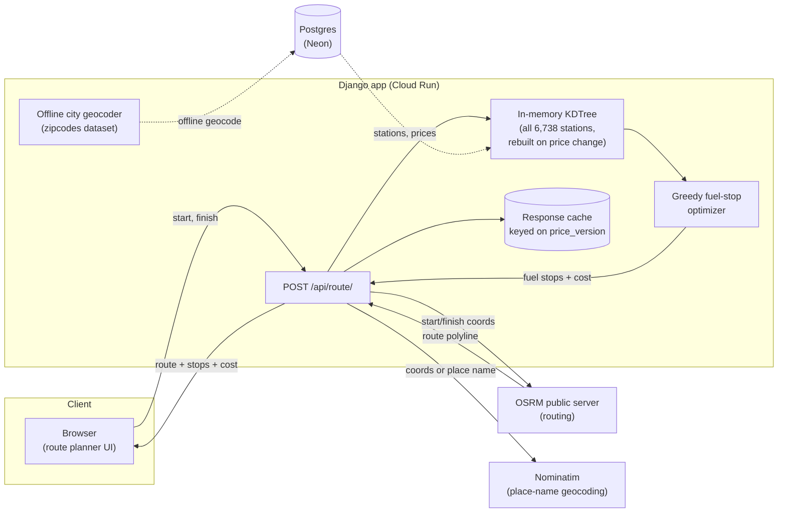
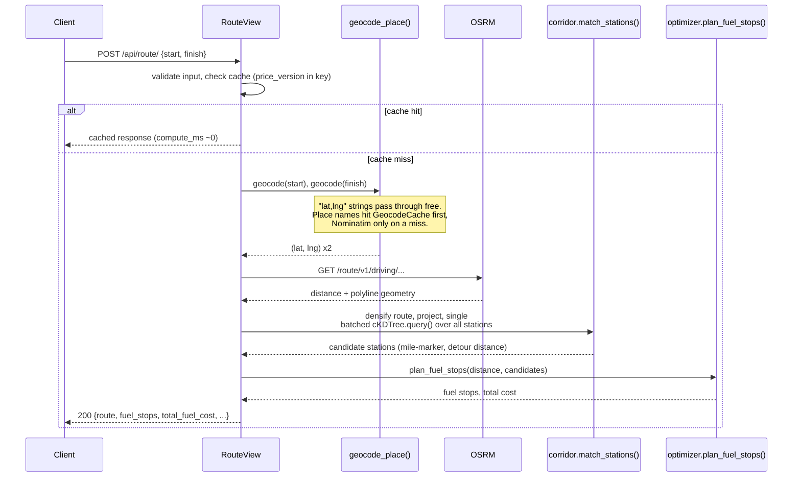
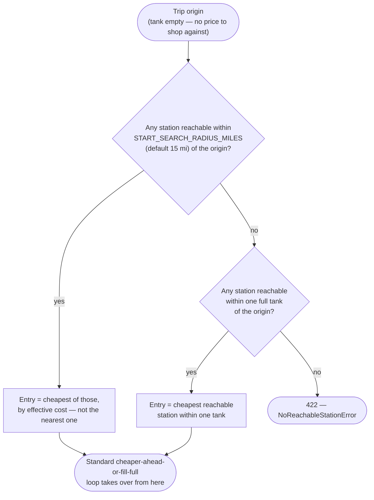
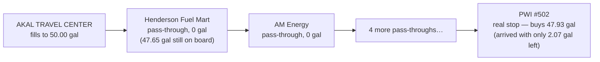
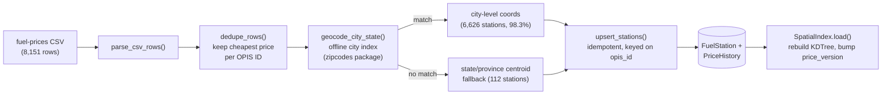

# Trucker — Fuel Route Optimizer

Given a start and finish location in the US, this returns the driving route, the cost-optimal
set of fuel stops for a 500-mile tank range at 10 mpg, and the total fuel cost — computed from a
real dataset of 6,738 truck stops. The route planner also offers a **Download JSON** button that
exports the full leg-by-leg trail — including stations the truck passes but doesn't buy from — for
offline auditing.

**Live demo: https://trucker-319172055462.us-east4.run.app**

| Page | What it shows |
|---|---|
| [`/`](https://trucker-319172055462.us-east4.run.app/) | Route planner — enter a start/finish, get the route + fuel stops on a map |
| [`/dashboard/`](https://trucker-319172055462.us-east4.run.app/dashboard/) | Fleet-wide price aggregates (avg/min/max, geocode precision, top networks) |
| [`/fuel/`](https://trucker-319172055462.us-east4.run.app/fuel/) | Searchable/filterable directory over all 6,738 stations |
| [`/analytics/`](https://trucker-319172055462.us-east4.run.app/analytics/) | Full state-by-state and brand-by-brand price breakdown |

---

## Contents

- [How it works](#how-it-works)
- [The optimizer, and why it's optimal](#the-optimizer-and-why-its-optimal)
  - [Choosing the first stop](#choosing-the-first-stop)
  - [Not hopping stop-to-stop for a splash of fuel](#not-hopping-stop-to-stop-for-a-splash-of-fuel)
  - [Auditing every stop: pass-throughs and the tank ledger](#auditing-every-stop-pass-throughs-and-the-tank-ledger)
- [Data pipeline](#data-pipeline)
- [Running it yourself](#running-it-yourself)
- [API](#api)
- [Price-update design](#price-update-design)
- [Assumptions](#assumptions)
- [Tech stack](#tech-stack)
- [Tests](#tests)

---

## How it works



A request only ever makes **one external HTTP call for coordinate input**, or **up to three**
for place names (two Nominatim lookups + one OSRM call) — everything else (station lookup,
corridor matching, the optimizer) runs against data already in memory or the database.

### Request sequence



### Corridor matching

Rather than build a tree over ~6,700 stations and probe it once per route point, the route
geometry (densified so no gap exceeds 2 miles, then downsampled to roughly one point per 2 miles)
becomes a small KDTree, and **every station is queried against it in one batched call**
(`scipy.spatial.cKDTree.query(..., workers=-1)`). That single call returns, for every station,
its nearest point on the route (→ mile-marker) and the distance to it (→ detour miles) — stations
farther than the configurable detour radius (default 10 mi) are dropped.

---

## The optimizer, and why it's optimal

At each stop, the rule is simple: **if a cheaper station is reachable within one full tank, buy
only enough fuel to reach it; otherwise fill up completely and drive to the cheapest station in
range.**


**Why this is optimal** *(for the classic, detour-free version of the problem)*: with a fixed
tank range, the cheapest way to fuel a trip is to always delay buying gas for as long as possible,
buying only enough to reach the next opportunity that's *at least as good*. At any station, if a
reachable station ahead is cheaper, buying more than the minimum needed to reach it is strictly
wasteful — those extra gallons could be bought cheaper very soon. Conversely, if nothing ahead is
cheaper, every gallon needed for the next full tank's worth of driving is best bought right now, at
the best price available for a while — so fill up completely. This is a textbook greedy-exchange
argument: any schedule that deviates from these two rules can be transformed into one that follows
them without increasing cost.

Three refinements on top of the textbook version:

1. **Stations reached by a detour are ranked by *effective* cost**, not sticker price. Since fuel
   is fungible once it's in the tank, the round-trip detour's cost is split by *when* each leg is
   driven: the outbound leg (route → pump) burns whatever's already blended in the tank, valued at
   the running weighted-average cost of held fuel; the return leg (pump → route) burns fuel bought
   right there, at that station's own price. Both legs are amortized over a full tank's capacity to
   get a comparable per-gallon rate:
   `price + (detour_miles / tank_range_miles) × (blended_avg_cost_in_tank + price)`.
   This is a **documented approximation, not an exact optimum** — it assumes a station reached by
   detour will end up selling close to a full tank's worth. When the actual amount bought there is
   much smaller (a thin price edge, a modest detour, but a purchase far short of a full tank), the
   toll can be over-amortized and a detour can look more attractive than it truly is. An exact fix
   would require comparing full downstream trip costs (a lookahead/DP), not a single per-station
   ranking formula — a larger change than the current single-pass greedy. `test_optimizer.py` has a
   test pinning this known behavior (`test_full_tank_amortization_is_a_known_approximation`) so a
   future change to the model is a conscious decision, not an accidental regression.
2. **The destination is a free, always-available target.** Once it's reachable on the current
   tank, the optimizer buys only the exact remainder needed and stops — it never tops off fuel
   that will never be used.
3. **The tank starts empty, not full — and the first stop is the cheapest nearby option, not
   simply the nearest one.** There's no fuel price defined at the origin itself, so the truck
   can't price-shop against a real baseline — see [Choosing the first
   stop](#choosing-the-first-stop) below for the full reasoning and a worked example. Every trip
   with positive distance buys real fuel and gets at least one stop; only a zero-distance trip
   (start == finish) needs none.

If nothing is reachable within one tank of the origin at all, or if any stretch of the route
exceeds the tank range with no station in reach on either side, the API returns `422` with the
exact position and shortfall, rather than silently failing.

### Choosing the first stop

The tank is empty at the origin, so the very first purchase can't be judged against a real
"current price" the way every later stop can. Naively, that suggests just fueling up at whichever
station happens to be *nearest* — but that's wrong. The origin-to-entry leg is unpriced for
**every** station within reach, not just the closest one, so a nearer-but-pricier station is never
worth visiting when a cheaper one is *also* reachable directly from the origin: entering there
instead has the same downstream effect at a strictly lower cost, since the "free" leg covers
either distance equally.



`START_SEARCH_RADIUS_MILES` (default `15`, configurable) keeps this realistic: a driver starting a
trip checks nearby stations, not every station up to a full tank away. If nothing qualifies that
close (a sparse area), the search falls back to the full tank range rather than stranding the
truck — the same "cheapest reachable, not nearest" rule, just over a wider net.

**Worked example** — two stations near the origin, tank range 150 mi:

| Station | Distance from origin | Price |
|---|---|---|
| A | 8 mi | $5.10/gal |
| B | 35 mi | $3.40/gal |

Naively fueling at A (the nearest) and bridging the 27 mi to B costs `2.7 gal × $5.10 = $13.77`
for fuel that's immediately replaced at B's cheaper price — pure waste. Since B is well within
`START_SEARCH_RADIUS_MILES`, the optimizer enters directly at B instead, skipping A entirely: one
stop, no wasted purchase. If B were *outside* the 15-mile radius (but still within one tank), A
would be the forced entry point instead, and the standard cheaper-ahead rule bridges from A to B
exactly as normal — the radius only changes which stations are *candidates* for the very first
decision, not the logic once a real entry point is chosen.

### Not hopping stop-to-stop for a splash of fuel

Near a city, truck stops are often packed within a few miles of each other at slightly different
prices. Taken literally, the cheaper-ahead rule above would treat every one of them as a fresh
opportunity — bridging to a station 2 miles up the road to save half a cent a gallon, buying a
fraction of a gallon there, then doing it again a mile later. That's cheaper on paper but not how
anyone actually fuels a truck.

**`MIN_PURCHASE_GALLONS`** (default `10`, configurable via env var) fixes this: a reachable station
only counts as "cheaper ahead" if bridging to it means buying at least this many gallons here —
otherwise it's skipped and the next reachable-and-cheaper station is tried, falling through to
filling up (or topping off to finish the trip) at the current station if none qualify. The one
exception is a **free coast**: if there's already enough fuel in the tank to reach a cheaper
station without buying anything at all, that's not a stop being made too small — no purchase
happens there, so the minimum never blocks it.

The same "already have enough" check applies to the fill-full branch itself: after filling up and
driving to the cheapest reachable station, arriving there with plenty of leftover fuel (e.g. a
50-gallon fill only 20 miles back) no longer forces a top-off purchase — it's a free pass-through,
just like a cheaper-ahead free coast, and the station won't appear as a stop at all unless fuel is
actually needed there.

### Auditing every stop: pass-throughs and the tank ledger

`fuel_stops` — the array rendered as map markers and the stop list — only ever contains real,
paid purchases. That's the right thing to *show*, but it's a misleading thing to *audit*: a station
skipped for costing $0 there is invisible in that list, so computing "does this leg's fuel cover
the next one" from `fuel_stops` alone silently drops legs and produces a false shortfall. A real
regression case: filling to a full 50-gallon tank, then coasting through **six** cheaper-than-
nothing-else-available stations in a row before the next real purchase —



— none of which show up in `fuel_stops`, even though the truck genuinely drove through (and
detoured off-corridor for) every one of them while evaluating whether to buy.

Two things fix this:

- **`all_stops`** is every station the route actually touches, in visiting order — `fuel_stops`
  plus the zero-purchase pass-throughs it omits, each tagged `"pass_through": true/false`.
- **`tank_gallons_arriving`** / **`tank_gallons_departing`** on every entry expose the optimizer's
  own internal fuel level directly, so `arriving + gallons bought = departing` is verifiable from
  the response itself — no need to re-derive it by hand or re-run the optimizer with debug output.

|  | leg miles | arriving | + bought | = departing | cap |
|---|---|---|---|---|---|
| ⛽ AKAL TRAVEL CENTER | 88.6 | 0.00 | 50.00 | **50.00** | 50.00 |
| ⋯ (6 pass-throughs) | 394.7 | 50.00 | 0.00 | 7.21 | 50.00 |
| ⛽ PWI #502 | 48.8 | 2.07 | 47.93 | **50.00** | 50.00 |
| ⛽ MAVERIK (Green River) | 298.6 | 19.86 | 30.14 | **50.00** | 50.00 |
| ⛽ Maverik #674 (Las Vegas) | 374.3 | 12.44 | 28.75 | **41.20** | 50.00 |

Every row balances and nothing exceeds the 50-gallon cap — by construction, since the fill-full
branch always computes `gallons_to_buy = tank_capacity - gallons_in_tank`, which can't overshoot.

The **Download JSON** button in the route planner UI exports exactly this: `fuel_stops`,
`all_stops`, and a derived `legs` array (`from` → `to`, miles, price, gallons, cost,
`pass_through`, and the same arriving/departing tank levels) — a complete, self-auditing
leg-by-leg trail for the whole trip.

---

## Data pipeline



`python manage.py load_fuel_data` is the entry point — it's a full offline pipeline with **zero
external network calls** (geocoding uses the `zipcodes` package's bundled US city/ZIP dataset, not
a live geocoding API) and is safe to re-run: unchanged rows are no-ops, changed prices append to
`PriceHistory`, and running it twice in a row produces `0` new stations and `0` price updates.

---

## Running it yourself

### Docker Compose (recommended)

```bash
docker compose up -d          # Postgres + Django, migrates on boot
docker compose exec web python manage.py load_fuel_data
```

Then open http://localhost:8000/.

### Local virtualenv

```bash
python -m venv .venv && source .venv/bin/activate   # or .venv\Scripts\activate on Windows
pip install -r requirements-dev.txt

cp .env.example .env    # edit DATABASE_URL to point at your Postgres

docker compose up -d db          # or run your own local Postgres
python manage.py migrate
python manage.py load_fuel_data
python manage.py runserver
```

### Tests (no Docker needed)

```bash
pytest
```

Uses an in-memory SQLite database (`config.settings.test`) — nothing under test relies on
Postgres-specific behavior, so this runs the full suite in about a second.

---

## API

### `POST /api/route/`

```bash
curl -X POST https://trucker-319172055462.us-east4.run.app/api/route/ \
  -H "Content-Type: application/json" \
  -d '{"start": "Milwaukee, WI", "finish": "Madison, WI"}'
```

`start` / `finish` each accept either `"City, ST"` or a raw `"lat,lng"` coordinate pair (the
latter skips geocoding entirely). The tank starts empty, so even a trip that fits under the tank
range buys real fuel at the cheapest nearby station (see [Choosing the first
stop](#choosing-the-first-stop)) and returns a real stop. Every stop also carries a `pass_through`
flag and the tank level immediately before/after it:

```json
{
  "total_distance_miles": 78.1,
  "total_fuel_cost": 26.27,
  "fuel_stops": [
    {
      "name": "SPEEDWAY #4214",
      "address": "I-45, EXIT 46 & US-100",
      "city": "Milwaukee",
      "state": "WI",
      "price_per_gallon": 3.366,
      "gallons": 7.81,
      "cost": 26.27,
      "miles_from_start": 0.0,
      "detour_miles": 0.1,
      "latitude": 43.0389,
      "longitude": -87.9065,
      "pass_through": false,
      "tank_gallons_arriving": 0.0,
      "tank_gallons_departing": 7.81
    }
  ],
  "all_stops": [ /* same shape as fuel_stops, but includes zero-purchase pass-throughs too */ ],
  "route": { "type": "LineString", "coordinates": [[-87.909, 43.039], ...] },
  "price_version": 1,
  "cached": false,
  "compute_ms": 2079.23
}
```

A longer trip returns multiple stops, and `all_stops` grows to include any pass-through waypoints
(see [Auditing every stop](#auditing-every-stop-pass-throughs-and-the-tank-ledger)):

```json
{
  "total_distance_miles": 2794.0,
  "total_fuel_cost": 884.88,
  "fuel_stops": [
    {
      "name": "DELTA",
      "address": "US-9",
      "city": "Jersey City",
      "state": "NJ",
      "price_per_gallon": 3.239,
      "gallons": 37.21,
      "cost": 120.53,
      "miles_from_start": 4.0,
      "detour_miles": 0.2,
      "latitude": 40.7328,
      "longitude": -74.0755,
      "pass_through": false,
      "tank_gallons_arriving": 0.0,
      "tank_gallons_departing": 37.21
    }
    /* ...more stops... */
  ],
  "all_stops": [ /* ...fuel_stops, interleaved with any pass-through waypoints... */ ],
  "route": { "type": "LineString", "coordinates": [ /* ... */ ] },
  "price_version": 1,
  "cached": false,
  "compute_ms": 1485.0
}
```

Repeating the exact same request returns `"cached": true` with `compute_ms` near zero — responses
are cached with the current `price_version` baked into the cache key, so a price reload
invalidates every cached route automatically without an explicit purge.

### Exporting a route

The route planner's **Download JSON** button (next to the "Fuel stops" heading, once a route is
planned) builds a self-contained file client-side from the API response: `start`/`finish`,
totals, `fuel_stops`, `all_stops`, and a derived `legs` array — one entry per `from → to` hop
(including the final leg into the destination), each carrying `leg_miles`, `price_per_gallon`,
`gallons`, `fuel_cost`, `pass_through`, and the arriving/departing tank levels. No extra API call
is made; it's the same response already rendered on the map, reshaped for offline review.

### `GET /api/places/?q=...`

Offline autocomplete for the Start/Finish inputs — zero network calls, backed by the same
`zipcodes` dataset used for station geocoding.

```bash
curl "https://trucker-319172055462.us-east4.run.app/api/places/?q=ne"
```

```json
{"results": [
  {"label": "Newark, NJ", "lat": 40.7361, "lng": -74.2251},
  {"label": "New York, NY", "lat": 40.7484, "lng": -73.9967}
]}
```

### Errors

| Status | When | Example |
|---|---|---|
| `400` | Missing/blank `start` or `finish` | `{"error": {"finish": ["This field is required."]}}` |
| `404` | A location couldn't be geocoded | `{"error": "Location not found: 'Zzzqqxnowhere'"}` |
| `422` | A stretch of the route exceeds the tank range with no reachable station | `{"error": "No fuel station reachable within 500 miles of mile 36.2 (532.9 miles remain to the destination) — route has an unreachable fuel gap."}` |
| `502` | OSRM or Nominatim didn't respond | `{"error": "OSRM request timed out."}` |

### Testing the API

A ready-to-run [Postman collection](postman/) covers both endpoints — happy paths, caching,
`400`/`404` errors, and scripted assertions on the optimizer's invariants (tank ledger balances
at every stop, pass-throughs cost nothing, the first stop respects the search radius). Runs
headless via `npx newman run postman/Trucker.postman_collection.json -e
postman/Trucker.Production.postman_environment.json`, or import all three files into the Postman
app. See [`postman/README.md`](postman/README.md) for details.

---

## Price-update design

- **`FuelStation`** holds current identity + price only; **`PriceHistory`** is an append-only log,
  one row per actual price change (not one row per load run — re-running the loader against
  unchanged prices produces zero new history rows).
- The loader (`load_fuel_data`) is an **idempotent upsert keyed on OPIS Truckstop ID**: new IDs
  insert, existing IDs update in place. Duplicate OPIS IDs within one CSV (a handful of stations
  are listed under two names) are deduped to the cheapest price before the upsert runs.
- A module-level `SpatialIndex` holds the KDTree, coordinate arrays, and an aligned price array in
  memory, rebuilt from the database after every load run. A `price_version` integer increments on
  every rebuild and is threaded into every cache key (routes, dashboard/analytics aggregates) —
  so a price refresh invalidates exactly the right cached responses without any explicit cache
  purge logic.

---

## Assumptions

- **USA-scoped, with real cross-border data left in.** The source CSV includes ~620 stations in
  Canadian provinces (border-adjacent truck stops); these are geocoded via province centroid
  fallback rather than dropped.
- **Tank starts empty** at the trip origin. There's no fuel price defined at the origin itself, so
  the truck fuels up at the *cheapest* station (by effective cost) within `START_SEARCH_RADIUS_MILES`
  of the origin — not simply the nearest one — falling back to the cheapest station within a full
  tank if nothing qualifies that close (see [Choosing the first stop](#choosing-the-first-stop)),
  before applying the same cheaper-ahead-or-fill-full rule as every other stop. If nothing is
  reachable within one tank of the origin at all, the API returns `422`.
- **10 mpg and a 500-mile range are fixed constants** (configurable via `MPG` /
  `TANK_RANGE_MILES` env vars), not derived from vehicle data — there's no vehicle model in this
  system.
- **Public OSRM and Nominatim servers, no API key.** These are rate-limited, shared, best-effort
  services; a production deployment at real scale would need a self-hosted OSRM instance and a
  paid/self-hosted geocoding service.
- **Station prices are a single snapshot.** The CSV was loaded once, so `PriceHistory` currently
  holds one entry per station — the model supports genuine price trends over time, but there's no
  real trend data yet (this is why the Dashboard doesn't show a time-series chart: there's nothing
  real to chart).
- **10-mile detour radius is a default, not a hard limit** — configurable via
  `DETOUR_RADIUS_MILES`, and factored into the optimizer's ranking (not just a binary
  include/exclude cutoff).
- **10-gallon minimum purchase is a default, not a hard rule** — configurable via
  `MIN_PURCHASE_GALLONS`; stations don't count as "cheaper ahead" unless bridging to them means
  buying at least this much fuel, so the optimizer doesn't hop between stations minutes apart to
  save a few cents (see "Not hopping stop-to-stop for a splash of fuel" above).
- **15-mile start-search radius is a default, not a hard limit** — configurable via
  `START_SEARCH_RADIUS_MILES`; bounds how far the truck is willing to shop around for its very
  first fill before falling back to a full tank's reach if nothing qualifies that close.

---

## Tech stack

Django 5.2 + Django REST Framework · PostgreSQL (Neon in production, Docker Compose locally) ·
psycopg 3 · numpy + scipy (`cKDTree`) for spatial matching · `polyline` for OSRM geometry ·
`zipcodes` for fully offline geocoding · OSRM public server for routing · Nominatim for
place-name geocoding · vanilla JS + Leaflet frontend, no framework · Docker + Docker Compose ·
deployed on Google Cloud Run.

## Tests

```
pytest
```

91 tests across dedupe/upsert idempotency, corridor matching, the optimizer (cheapest-reachable
entry-point selection and its start-search-radius fallback, cheaper-ahead partial buy, fill-full,
unreachable-gap failure, blended-average detour-cost ranking, minimum-purchase filtering),
dashboard/analytics aggregation, station-directory filtering, and offline place search — all
against synthetic data, no network calls, runs in about a second.
